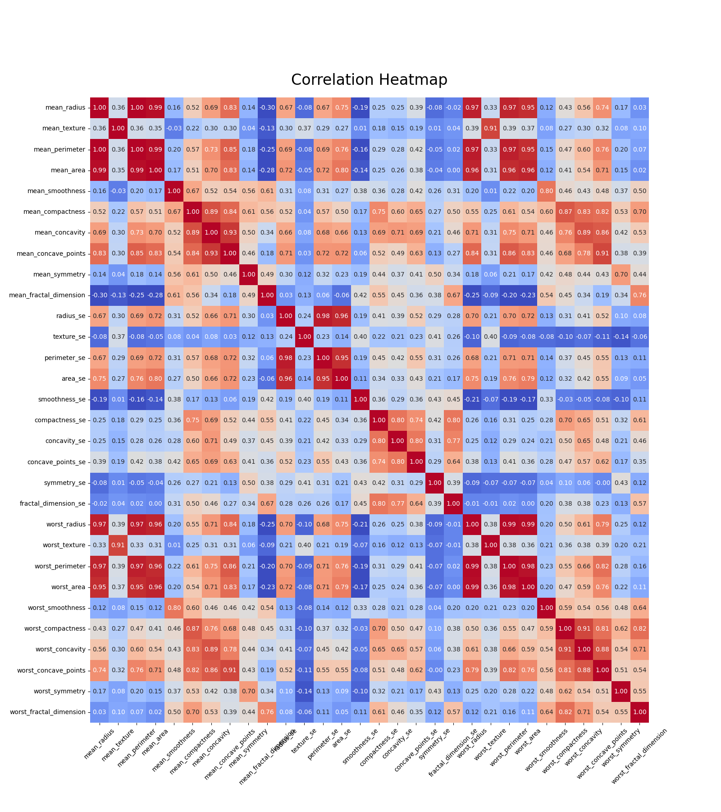

Project in progress, check back soon for updates...

<h1 align="center">Multilayer-Perceptron</h1>


<div align="center">

</div>


Table of Contents
=================

   * [A Machine Learning Project](#a-machine-learning-project)
      * [What is a Multilayer Perceptron?](#what-is-a-multilayer-perceptron)
      * [Perceptron](#perceptron)
   * [Project Instructions and Dataset](#breakdown-of-the-project)
      * [Objectives](#objectives)
      * [Dataset](#dataset)
   * [Installation](#installation)
   * [Project Walkthrough](#project-walkthrough)
      * [CLI](#cli)
      * [Data Analysis](#data-analysis)
      * [Data Preprocessing](#data-preprocessing)
      * [Model](#model)
      * [Training](#training)
      * [Evaluation](#evaluation)
      * [Predictions](#predictions)
      * [Conclusion](#conclusion)


## A Machine Learning Project

This project is an introduction to artificial neural networks, with the
implementation of a multilayer perceptron (MLP)

### What is a Multilayer Perceptron?

The `multilayer perceptron` is a feedforward network (meaning that the data
flows from the input layer to the output layer)
defined by the presence of one or more hidden layers as well as an
interconnection of all the neurons of one layer to the next.

<div align="center">

</div>

The diagram above represents a network containing 4 dense layers (also called fully connected layers). Its inputs consist of 4 neurons and its output of 2 (perfect for binary classification). The weights of one layer to the next are represented by two-dimensional matrices noted `W_l0_l1`. The matrix `W_l0_l1` is of size (3, 4), for example, as it contains the weights of the connections between the layer l0 and the layer l1.

The bias is often represented as a special neuron which has no inputs and with an output always equal to 1. Like a perceptron, it is connected to all the neurons of the following layer (`b_lj` on the diagram above). The bias is generally useful as it allows to “control the behavior” of a layer.


### Perceptron

The `perceptron` is the type of neuron that the `multilayer perceptron` is composed
of. They are defined by the presence of one or more input connections, an activation
function and a single output. Each connection contains a weight (also called parameter)
which is learned during the training phase.

<div align="center">

</div>

Two steps are necessary to get the output of a neuron. 

- The first one consists in
computing the weighted sum of the outputs of the previous layer with the weights of the
input connections of the neuron, which gives the value `z` or `weighted sum`.

<div align="center">

</div>

- The second step consists in applying an activation function on this weighted sum,
the output of this function being the output of the perceptron, and can be understood
as the threshold above which the neuron is activated (activation functions can take a lot
of shapes, you are free to chose whichever one you want depending on the model to
train, here are some of the most frequently used ones to give you an idea : sigmoid,
hyperboloid tangent, rectified linear unit).

## Project Instructions and Dataset

### Objectives

The goal of this project is to give you a first approach to artificial neural networks,
and to have you implement the algorithms at the heart of the training process. At the
same time you are going to have to get reacquainted with the manipulation of
derivatives and linear algebra as they are indispensable mathematical tools for the
success of the project.

### Dataset

The dataset is provided in the data directory. It is a csv file of 32 columns, the column
diagnosis being the label you want to learn given all the other features of an example,
it can be either the value M or B (for malignant or benign).

The features of the dataset describe the characteristics of a cell nucleus of breast
mass extracted with [fine-needle aspiration](https://en.wikipedia.org/wiki/Fine-needle_aspiration). (for more detailed information, go [here](https://archive.ics.uci.edu/ml/machine-learning-databases/breast-cancer-wisconsin/wdbc.names)).

As you will see, there is an important work of data understanding before starting to
implement the algorithm which will be able to classify it. A good practice would be to
begin by playing with the dataset by displaying it with graphs, visualizing and
manipulating its different features.

You have to separate your data set into two parts yourself, one for training and one
for validation.

## Installation

I've supplied a Makefile to help you set up and run the project. To install the
dependencies, run:

```bash
make setup
```

To run the project, run:

```bash
make start
```

Feel free to launch the program on a terminal and follow along with the README
while I walk you through the project. I hope you enjoy it!

## Project Walkthrough

We are all familiar with libraries like `Tensorflow` and `Keras` that allow us to
implement neural networks with a few lines of code. However, in this project, we are
going to implement the algorithms at the heart of the training process of a neural
network. This will allow us to understand the underlying mechanisms of these
libraries and to have a better grasp of the mathematical concepts behind neural
networks.

---

### CLI

To simplify the user experience, I have implemented a CLI `cli.py` that will allow you to
interact with the project. The CLI will guide you through the different steps of the
project, from data preprocessing to the evaluation of the model. It Will allow you to load
pretrained models, or configure your own models and train them.

I have supplied two pretrained models and configurations. We will go into more
details further on. Below is a short breakdown of each model:

<details>
<summary><strong>Click to reveal model configurations</strong></summary>

- Softmax Model (data/models/softmax_model.json):
  - An `Input layer` of size 30. (the number of features in the dataset)
  - The first hidden layer, a `Dense Layer`:
    - 16 Neurons
    - `lrelu` activation function (Leaky ReLU)
    - `he_normal` kernel initializer
  - The second hidden layer, a `Dropout Layer`:
    - 0.2 Dropout rate (How many neurons to drop during training)
  - The output layer, a `Dense Layer`:
    - 32 Neurons
    - `prelu` activation function (Parametric ReLU)
    - `he_normal` kernel initializer
  - The third hidden layer, another `Dropout Layer`:
    - 0.4 Dropout rate
  - Outer layer, a `Dense Layer`:
    - 2 Neurons
    - `softmax` activation function
    - `glorot_uniform` kernel initializer
  - Optimizer:
    - `adam` optimizer (Adaptive Moment Estimation)
    - learning rate of 0.00001
  - Loss:
    - `binary_crossentropy` loss function (Binary Cross Entropy)
  - Batch Size:
    - 32 (How many examples to process at once)
  - Epochs:
     - 100,000 (How many 'loops' through the dataset to make) 

---

- Sigmoid Model (data/models/sigmoid_model.json):
  - An `Input layer` of size 30. (the number of features in the dataset)
  - The first hidden layer, a `Dense Layer`:
    - 16 Neurons
    - `lrelu` activation function (Leaky ReLU)
    - `he_normal` kernel initializer
  - The second hidden layer, a `Dropout Layer`:
    - 0.1 Dropout rate (How many neurons to drop during training)
  - The output layer, a `Dense Layer`:
    - 32 Neurons
    - `prelu` activation function (Parametric ReLU)
    - `he_normal` kernel initializer
  - The third hidden layer, another `Dropout Layer`:
    - 0.2 Dropout rate
  - Outer layer, a `Dense Layer`:
    - 1 Neuron
    - `sigmoid` activation function
    - `glorot_uniform` kernel initializer
  - Optimizer:
    - `rmsprop` optimizer (Adaptive Moment Estimation)
    - learning rate of 0.00001
  - Loss:
    - `binary_crossentropy` loss function (Binary Cross Entropy)
  - Batch Size:
    - 32 (How many examples to process at once)
  - Epochs:
     - 100,000 (How many 'loops' through the dataset to make

</details>

---

### Data Analysis

**Understanding the Data**

Before we start implementing the neural network, we need to understand the data we are working with. This involves several key aspects:

- **Data Exploration:** Exploring the dataset to understand its structure, dimensions, and basic statistics.
  
- **Feature Analysis:** Analyzing individual features to identify their distributions, ranges, and potential correlations with the target variable.

- **Data Preprocessing:** Preprocessing steps such as handling missing values, scaling features, and encoding categorical variables if necessary.

- **Visualization:** Using visual tools to gain insights into the data, such as histograms, scatter plots, and correlation matrices.

<details>
<summary><strong>Click to reveal plots</strong></summary>

Data Distribution:

When training models, you want to make sure that the data is balanced. If the data is not balanced, the model may be biased towards the majority class. Below is a plot of the data distribution:

<div align="center">

</div>

Pairplot:

Another factor to consider is the relationship between features. A pairplot allows us to visualize the relationships between different features in the dataset. This can help identify patterns and correlations that may be useful for training the model. We can check if certain features are highly correlated, which may indicate multi-collinearity. 

Below we see there are strong correlations between some features, which may indicate multicollinearity. This can be problematic for some models, such as linear regression, but neural networks are generally robust to multi-collinearity.

<div align="center">

</div>

Correlation Heatmap:

A correlation heatmap provides a visual representation of the correlation between different features in the dataset. This can help identify which features are most strongly correlated with the target variable and with each other.

<div align="center">

</div>


</details>

In summary, plotting the data allows to quickly identify patterns, trends, and relationships between features. This can help guide the feature selection process and provide insights into the data that may be useful for training the model.

---

## Multilayer-Perceptron - `mlp.py`

The `mlp.py` file contains the implementation of the `Multilayer Perceptron` class. This class is responsible for creating the neural network, training it, evaluating, and making predictions. The class is designed to be flexible and customizable, allowing you to configure the network architecture, activation functions, loss functions, and optimization algorithms.

### Data Preprocessing

Before training the model, we need to preprocess the data. This involves several key steps:

- **Feature Scaling:** Scaling the features to ensure they are on a similar scale. This can help improve the convergence of the optimization algorithm and prevent certain features from dominating the model.
- **Train-Test Split:** Splitting the data into training and testing sets. This allows us to train the model on one set of data and evaluate its performance on another set.
- **One-Hot Encoding:** Encoding categorical variables as one-hot vectors. This is necessary for certain models that require numerical inputs.
- **Data Normalization:** Normalizing the data to ensure that the features have a mean of 0 and a standard deviation of 1. This can help improve the convergence of the optimization algorithm.

While training the model, we need a validation set of data. This will allow us to test the model performance on unseen data. The validation set is used to tune the hyperparameters of the model and prevent overfitting.

### Model

The `Multilayer Perceptron` class allows you to configure the network architecture, activation functions, loss functions, and optimization algorithms. You can customize the number of layers, the number of neurons in each layer, the activation functions, and the loss function. You can also choose from a variety of optimization algorithms, such as `Adam`, and `RMSprop`. Our model is based on a `Sequential` architecture, where each layer is connected to the next in sequence.

<details>
<summary><strong>Click to reveal model architecture</strong></summary>

- **Layers**:
  - `Dense Layer`: A fully connected layer with a specified number of neurons and activation function.
  - `Dropout Layer`: A regularization layer that randomly drops a specified percentage of neurons during training.
  - `Input Layer`: The input layer of the network, with a specified number of features.


- **Activation Functions**:
  - `Sigmoid`: The sigmoid activation function, which squashes the output between 0 and 1.
  - `ReLU`: The rectified linear unit activation function, which is commonly used in deep learning models.
  - `Leaky ReLU`: A variant of the ReLU activation function that allows a small gradient when the input is negative.
  - `PReLU`: The parametric ReLU activation function, which learns the slope of the activation function during training.
  - `Softmax`: The softmax activation function, which is commonly used in multi-class classification problems.
  - `Tanh`: The hyperbolic tangent activation function, which squashes the output between -1 and 1.


- **Regularization Techniques**:
  - `L1 Regularization`: A regularization technique that adds a penalty term to the loss function based on the absolute value of the weights.
  - `L2 Regularization`: A regularization technique that adds a penalty term to the loss function based on the squared value of the weights.


- **Loss Functions**:
  - `Binary Crossentropy`: The binary cross-entropy loss function, which is commonly used in binary classification problems.
  - `Categorical Crossentropy`: The categorical cross-entropy loss function, which is commonly used in multi-class classification problems.


- **Optimization Algorithms**:
  - `Adam`: Adaptive Moment Estimation, an optimization algorithm that combines the benefits of both AdaGrad and RMSProp.
  - `RMSprop`: Root Mean Square Propagation, an optimization algorithm that uses a moving average of the squared gradients to update the weights.


- **Initializers**
  - `Glorot Normal`: Glorot Normal initialization, which initializes the weights using a normal distribution with a mean of 0 and a standard deviation based on the number of input and output units.
  - `He Normal`: He Normal initialization, which initializes the weights using a normal distribution with a mean of 0 and a standard deviation based on the number of input units.
  - `Glorot Uniform`: Glorot Uniform initialization, which initializes the weights using a uniform distribution with a range based on the number of input and output units.
  - `He Uniform`: He Uniform initialization, which initializes the weights using a uniform distribution with a range based on the number of input units.


- **Callbacks**
  - `Early Stopping`: A callback that stops training when a monitored metric has stopped improving.

</details>

### Training

### Evaluation

### Predictions

### Conclusion


